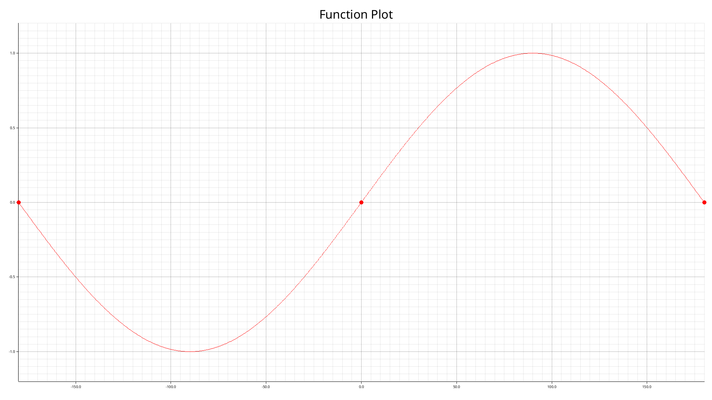

# Arithmetic Compiler  

An Arithmetic Compiler built in Rust, utilizing **Recursive Descent Parsing** for AST creation and **Postfix Notation** for evaluation.  

This project is designed for parsing, evaluating, and visualizing arithmetic expressions. It supports features like variable management, root finding, and plotting, making it a comprehensive tool for mathematical expression handling.  

## Table of Contents  

- [Features](#features)  
- [Getting Started](#getting-started)  
- [Supported Tokens](#supported-tokens)
- [Usage Examples](#usage-examples)  
  - [Lexer](#lexer)  
  - [Parser and AST](#parser-and-ast)  
  - [Evaluation](#evaluation)  
  - [Postfix Representation](#postfix-representation)  
  - [Finding Roots](#finding-roots)  
  - [Plot](#plot)  
- [Contributing](#contributing)

## Features  

- **Lexical Analysis**: Tokenizes arithmetic expressions for parsing.
- **Parser**: Constructs an Abstract Syntax Tree (AST) using Recursive Descent Parsing.
- **AST Representation**: Represents expressions hierarchically for evaluation.
- **Evaluator**: Computes the result of the AST using Postfix Notation and a stack-based approach.
- **Variable Manager**: Enables the use of variables by storing and retrieving their values.
- **Root Finding**: Calculates roots of functions within a given range using the Bisection Method.
- **Plotting**: Visualizes functions over a specified range using the custom evaluator.
- **Error Handling**: Provides detailed feedback for syntax, evaluation, and runtime errors.

## Getting Started  

Follow these steps to set up and run the project:

1. **Clone the Repository**

```bash
   git clone <repository-url>
   cd arithmetic
```

2. **Run the Project**

```bash
cargo run
```

**Note:** Make sure to have rust installed.

## Supported Tokens

This compiler supports a variety of tokens for processing mathematical expressions. Below is a comprehensive list:

**Literals:**

- **Numbers:**
  - Integers (i64)
  - Floats (f64)

**Identifiers:**

- Variables: e.g., `x`, `y`

**Operators:**

- **Arithmetic Operators:**

  - `+` (Addition)
  - `-` (Subtraction)
  - `*` (Multiplication)
  - `/` (Division)
  - `^` (Exponentiation)

- **Integer Division and Modulus:**
  - `div` (Integer Division)
  - `mod` (Modulus)

**Separators:**

- **Parentheses:**

  - `(` (Left Parenthesis)
  - `)` (Right Parenthesis)

**Mathematical Functions:**

- **Trigonometric Functions:**
  - `sin`, `cos`, `tan`, `cotan`
- **Inverse Trigonometric Functions:**
  - `arcsin`, `arccos`, `arctan`, `arccotan`
- **Logarithmic and Exponential Functions:**
  - `ln` Natural Logarithm
  - `log` Logarithm
  - `exp` Exponential Function
- **Square and Square Root:**
  - `sqrt` Square Root
  - `sqr` Square

**Constants:**

- **Mathematical Constants:**
  - e Euler’s Number
  - π Pi

**Special Tokens:**

- `Eof`: End of input.

## Usage Examples

### Lexer

The input is tokenized by the lexer.

**Sample Input:**

```txt
2 + 3^2 + cos(x)
```

**Sample Output:**

```text
Lexer Output. Token Stream:
Token: Number(Integer(2))
  Span: TextSpan { start: 0, end: 1, literal: "2", line: 1, column: 0 }

Token: Plus
  Span: TextSpan { start: 2, end: 3, literal: "+", line: 1, column: 2 }

Token: Number(Integer(3))
  Span: TextSpan { start: 4, end: 5, literal: "3", line: 1, column: 4 }

Token: Power
  Span: TextSpan { start: 5, end: 6, literal: "^", line: 1, column: 5 }

Token: Number(Integer(2))
  Span: TextSpan { start: 6, end: 7, literal: "2", line: 1, column: 6 }

Token: Plus
  Span: TextSpan { start: 8, end: 9, literal: "+", line: 1, column: 8 }

Token: Cos
  Span: TextSpan { start: 10, end: 13, literal: "cos", line: 1, column: 10 }

Token: LeftParen
  Span: TextSpan { start: 13, end: 14, literal: "(", line: 1, column: 13 }

Token: Identifier("x")
  Span: TextSpan { start: 14, end: 15, literal: "x", line: 1, column: 14 }

Token: RightParen
  Span: TextSpan { start: 15, end: 16, literal: ")", line: 1, column: 15 }
```

### Parser and AST

The parser constructs an Abstract Syntax Tree (AST) using Recursive Descent Parsing (RDP).

**Sample Input:**

```txt
2 + 3^2 + cos(x)
```

**Sample Output:**

```text
└── +
    ├── +
    │   ├── 2
    │   └── ^
    │       ├── 3
    │       └── 2
    └── cos
        └── x
```

### Evaluation

Evaluates the expression using a variable manager and Postfix Notation.

**Sample Input:**

```txt
2 + 3^2 + cos(x)
```

**Prompt:**

``` text
Please Enter the value for x:
> 180
```

**Sample Output:**

```text
Evaluation result: 10
```

### Postfix representation

Generates the Postfix Notation String from the AST.

**Sample Input:**

```txt
2 + 3^2 + cos(x)
```

**Sample Output:**

```text
2 3 2 ^ + x cos + 
```

### Finding roots

Determines the roots of a function within a specified range using the Bisection Method.

**Sample Input:**

```text
sin(x)
```

**Prompt:**

```text
Please Enter the value for a:
> -180

Please Enter the value for b:
> 180
```

**Sample Output:**

```text
Roots: -180.000, 0.000, 180.000
```

### Plot

Plots the function within the specified range.

**Sample Input:**

```text
sin(x)
```

**Prompt**  

```text
Please Enter the value for a:
> -180

Please Enter the value for b:
> 180
```

**Sample Output:**

A plot image is generated and saved in the plot directory.



## contributors

- **Amirhossein Edadi**
- **Amin Owrang Pour**
- **Amin Sheikh Azimi**
